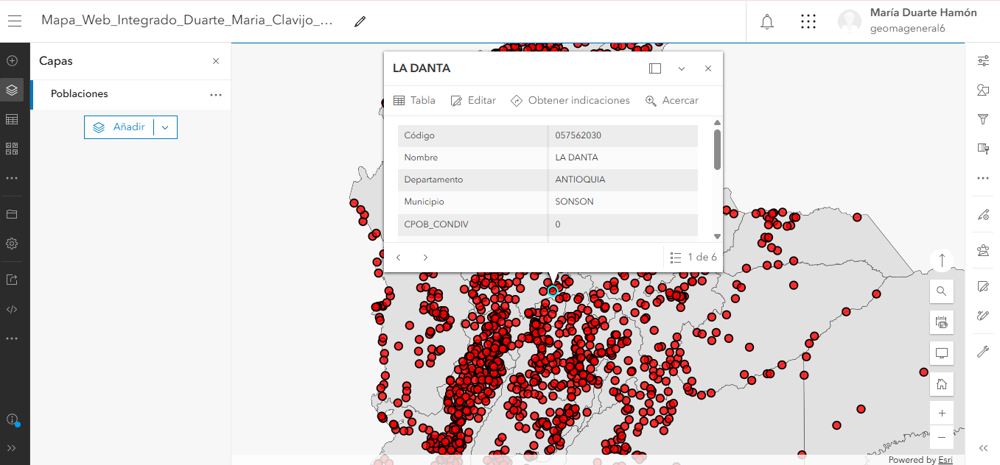
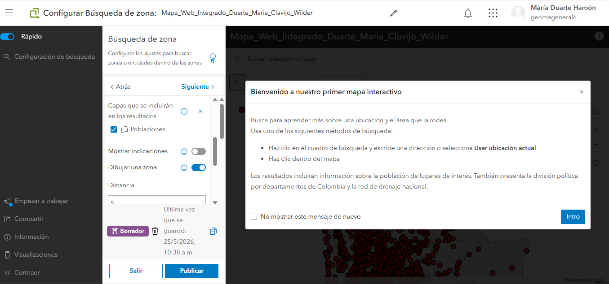
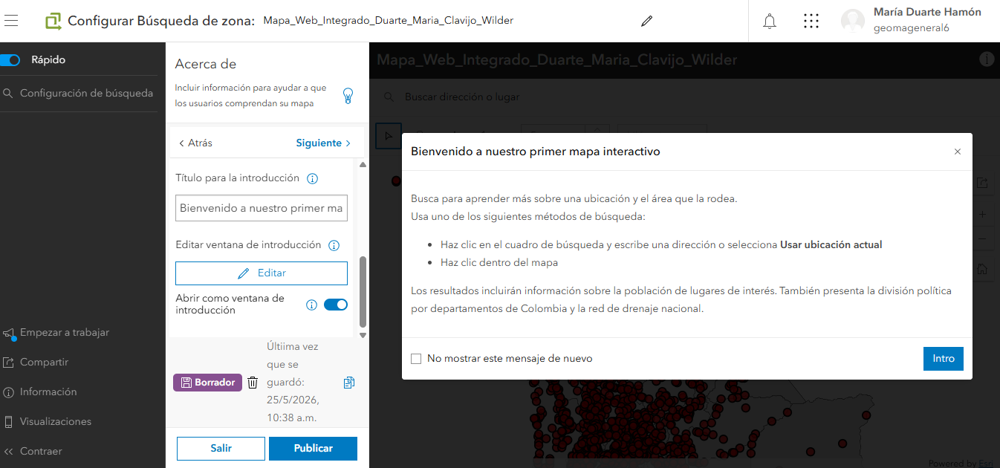
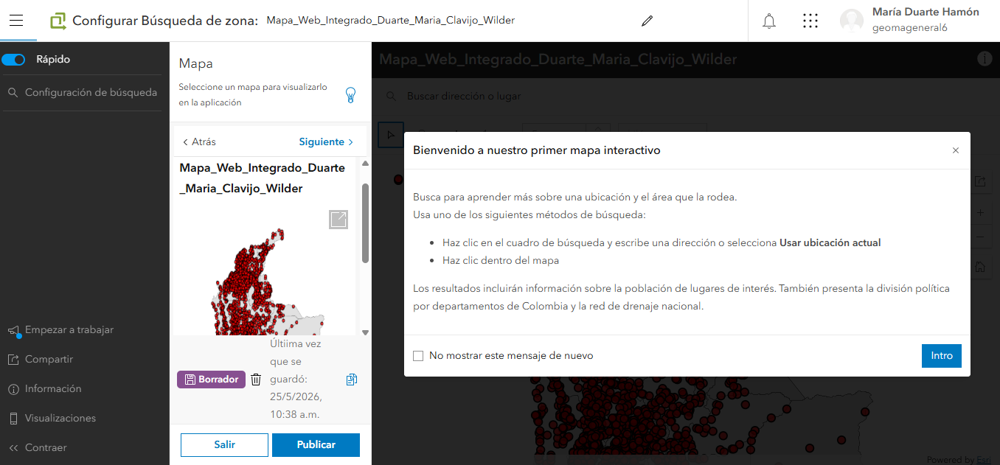

## Imagenes del proceso

A continuación se presentan las imágenes del proceso de configuración de la base de datos y de exportación desde ArcGIS Pro hacia ArcGIS online, así como la verificación del resultado obtenido. 

## Creación de la Aplicación

Se configuro como InstantApps, para esto se siguió las recomendaciones de creación según las preguntas guía y se seleccionó como opción **Búsqueda de zona**

Para la elaboración de nuestra aplicación se utilizó la función “Instant App” bajo la cual, como vemos en la (Figura 7) se centra en la interacción con los datos referentes a poblaciones, utilizando la búsqueda convencional y el filtrado por la posibilidad de dibujar una zona de interes 

En el caso de la (Figura 8), hacemos referencia a los detalles estéticos de la aplicación, por los cuales somos capaces de diferenciar la experiencia al usuario, describiendo las funciones, la finalidad de la app y diferentes opciones que son capaces de modificar la experiencia en la página 

Finalmente, evidénciamos el apartado base de toda la aplicación, la fuente de datos bajo la cual se estructuran las funciones finales, además de poder agregar capas de diferente índole, abriendo la posibilidad de diversificar los usos de una misma app según la información requerida y suministrada en esta pestaña 

**Link de la aplicación** https://unalmed.maps.arcgis.com/apps/instant/lookup/index.html?appid=0cc61f7d227a438181f61eaed5235f07

## Preguntas

**Pregunta 1: ¿Qué ventajas mecánicas y de rendimiento ofrece el formato de teselas vectoriales (Vector Tiles) en comparación con servicios tradicionales de teselas ráster (WMS) al desplegar cartografía base en dispositivos móviles y navegadores web? Considere: tamaño de paquetes de datos, consumo de ancho de banda, escalabilidad de estilos y compatibilidad con resoluciones de pantalla variables.**

Los vector Tiles tienen diversas ventajas como un menor tamaño de los paquetes de datos ya que alamcenan los atributos en tamaño comprimido lo que reduce la cantidad de datos transmitidos en comparación con los servicios ráster que presentan imágenes completas, por esto, la carga de mapas es más rápida y eficiente cuando se trabajan desde condiciones móviles o de baja velocidad. Otra ventaja es la adaptación a diversas resoluciones de pantalla ya que las teselas vectoriales se renderizan de forma dinámica lo que mantiene la cálidad de los datos en diversas pantallas sin necesidad de generar las imágenes de nuevo. 

Por lo anterior, al reducir la carga en el servidos y aprovechar la capacidad de procesamiento de cada dispositivo la experiencia de navegación es mejor que al utilizar formatos ráster cuyo paquete de datos es más grande, el consumo de ancho de banda es mayor y su compatibilidad y adapatabilidad a resoluciones de pantalla variables es menor. 

**Pregunta 2: Explique la transformación que sufren los datos geoespaciales locales (shapefile/geodatabase) al ser publicados como una Hosted Feature Layer en la infraestructura cloud de ArcGIS Online. ¿Qué cambios ocurren en el almacenamiento de geometrías, proyecciones y tablas de atributos?**

Este proceso se compone de diferentes fases que incluyen la carga y conversión de datos a un formato optimizado para servicios web de la infraestructura cloud de ArcGIS, a continuaciòn, los puntos, líneas y polígonos pasan a almacenarse en bases de datos accesibles administradas por Esri, luego se hace la reproyección de coordenadas a Web Mercator Auxiliary Sphere (EPSG:3857), aunque los datos conservan la referencia espacial original para el análisis y consultas, las tablas de información asociadas se convierten en estructuras compatibles con la base de datos preservando campos y dominios, por último, se optimizan los atributos para mejorar el rendimiento de consultad, filtros y visualización. 

**Pregunta 3: Justifique técnicamente la selección del rango de escalas implementado en la Parte 2 (configuración de Scale Range para drenajes). ¿Cómo afecta la densidad de vértices y el solapamiento de etiquetas a la velocidad de transferencia de paquetes de datos en conexiones móviles de baja velocidad?**

Cuando se trabaja a escalas pequeñas mostrar todos los drenajes genera gran cantidad de líneas que no aportan la información que se requiere cuando se utilizan esas escalas pequeñas, por lo que es mejor configurarlos para escalas mayores. Con esta limitación en la visualización se evita el solapamiento de etiquetas y por tanto se necesitan paquetes más pequeños lo que disminuye los tiempos de descarga y el procesamiento geográfico necesario por tanto mejor la velocidad de renderización, claridad visual y la experiencia del usuario. 

**Pregunta 4: En el contexto de la interoperabilidad, explique cómo el uso de sistemas de referencia estándar (MAGNA-SIRGAS para almacenamiento local frente a Web Mercator en servicios web) facilita la integración con terceras plataformas.**

Para este ejercicio se trabajó con el sistema geodésico oficial de Colombia MAGNA-SIRGAS (EPSG:9377) que son alamcenados y publicados mediante la reproyecciòn de Web Mercantor que es el estandar de mapas de internet, esta combinación permite aprovechar la precisión de un sistema nacional y asegurar la integración eficiente con aplicaciones y servicios utilizados globalmente. Así, se mantiene la precisión cartográfica requerida para trabajos técnicos y análisis espaciales y facilita el intercambio de información ebtre diferentes plataformas SIG. 